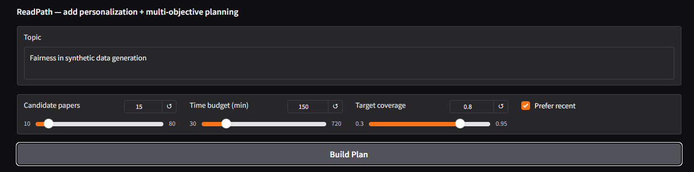

# ReadPath: Coverage-First Reading Planner (with Graph View + LLM Agent)

**One-evening, end-to-end system** that helps a user quickly plan what to read on any research topic.  
It fetches open papers from **OpenAlex**, builds a **Paper↔Concept** graph, chooses a minimal set of papers that **maximizes concept coverage under a time budget**, and visualizes it.  
A built-in **LLM agent** answers grounded questions from the same corpus.

---

## Table of contents

- [What you get](#what-you-get)
- [Quick start](#quick-start)
- [Inputs and outputs](#inputs-and-outputs)
- [How it works](#how-it-works)
- [Example](#Example)
- [Credits](#license--credits)

---

## What you get

- **Coverage-first reading plan**: minimal set of papers that hits your target concept coverage within your time budget.
- **Interactive graph**: papers (blue/orange) and concepts (green) with edges for *covers* and *cites*.  
  Works inside Colab/Gradio using a lightweight **vis-network** embed.
- **Grounded Q&A**: ask the corpus anything; responses cite `[1] [2] …` and map to the plan’s order.
- **Artifacts** saved to `artifacts/` (CSV plan).

---

## Quick start

### 1) Run in Google Colab (recommended)
1. Open the notebook `ReadPath.ipynb`.
2. Install Requirements. 
3. In **Planner** section, enter:
   - *Topic* (e.g., “Graph RAG”),
   - *Candidate papers* (20–50),
   - *Time budget* in minutes,
   - *Target coverage* (0.5–0.9),
   - *Prefer recent* (checkbox).
4. Click **Build Plan** → you’ll see the reading plan, concept table, truth card, and an interactive graph.
5. (Optional) Run the **Agent** section:
   - Enter your `OPENAI_API_KEY` when prompted.
   - Use the **Ask the Papers** tab for grounded Q&A.
  
### 2) Run Docker: 
1. 

---

## Inputs and outputs

### Inputs (UI knobs)
1. **Topic**: query sent to OpenAlex to fetch candidates.
2. **Candidate papers**: pool size (too small → miss coverage; too big → slower).
3. **Time budget (min)**: total reading time constraint.
4. **Target coverage**: fraction of concept weight to cover (0–1).
5. **Prefer recent**: bias candidates toward newer works.

### Outputs
1. **Reading Plan (table)**
   `order · title · year · est_read_min · oa_url`
   order is the suggested sequence; est_read_min is a rough estimate used by the planner.
3. **Top Covered Concepts (table)**
   Most-important concepts (by TF-IDF weight) covered by the selected set.
4. **Graph (interactive)**
   Blue = papers, orange = selected papers, green = concepts
   Edges: paper→concept (covers), paper→paper (cites).
5. **Truth Report (JSON) and Read Plan**

---

## How it works

1. Fetch candidate papers from OpenAlex for your topic (open data).
2. Parse titles/abstracts and extract candidate concepts (token n-grams; RAKE-like + TF-IDF).
3. Build a bipartite directed graph:
   `(paper) —covers→ (concept)` and `(paper) —cites→ (paper)`.
4. Estimate read time per paper.
5. **Select a plan with greedy weighted set cover under a time budget:**
   repeatedly pick the paper that maximizes marginal concept weight gain / minute until coverage ≥ target or time is used.
6. Prune redundant papers (irredundancy).
7. Render graph in-notebook using a vis-network HTML snippet (robust in Colab/Gradio).
8. **LLM Agent:**
   Grounded Q&A – Retrieves snippets from the same corpus, then calls OpenAI `gpt-4o-mini` to produce a concise answer with bracket citations `[1] [2] …` matching the plan order.

---

## Example

-Copy.png)
-Copy.png)
-Copy.png)
.png)
.png)
.png)

---

## Credits

- **Data**: [OpenAlex](https://openalex.org/) (open bibliographic data).
- **Libraries**: `networkx`, `scikit-learn`, `gradio`, `vis-network` (via CDN), `openai`.
- **Idea**: coverage-first planning + grounded agent for efficient reading under time pressure.
